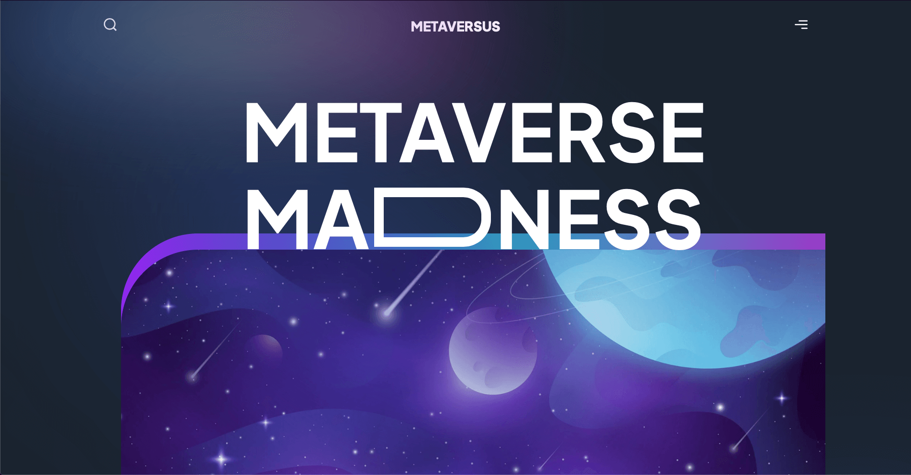

# Metaversus | Landing Page




> Essa é uma Landing Page baseada no conceito de Metaverso e Realidade Virtual. Além de conter animações visualmente elegantes, possui um Design Moderno e atraente.

### 📒 Tecnologias Usadas


## 💻 Pré-requisitos

Antes de começar, verifique se você atendeu aos seguintes requisitos:

* Você instalou a versão estável ou a mais recente do `Node.js`
* Possui o `Git` instalado na sua máquina

## 🚀 Instalando o projeto

Para clonar o projeto em sua máquina, siga estas etapas:

Windows, Linux e macOS:
```
git clone https://github.com/Nelson-DevStack/metaverso
cd metaverso
yarn
```

## ☕ Executando o projeto

Para executar o projeto no servidor local (localhost:3000), execute o comando:

```
yarn run dev
```


[⬆ Voltar ao topo](#metaverso)<br>
